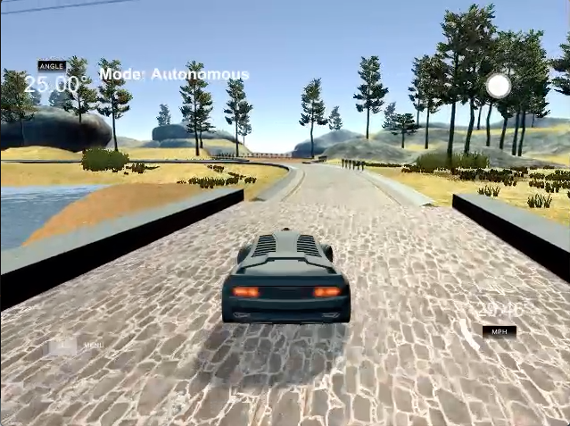
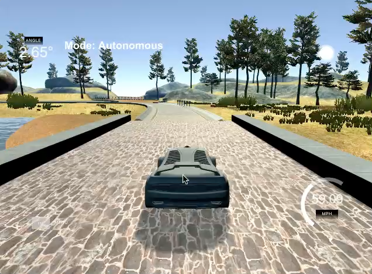

# CarND-Controls-PID
Self-Driving Car Engineer Nanodegree Program

---

## Describe the effect each of the P, I, D components had in your implementation.
- The P error term is proportional to the cross-track error (CTE, in aviation, where this term is well known to pilots, this term is usually referred to as XTE. I will follow this notation here). This is the part of the controller that directly proportionally reacts to the XTE. Hightly weighting this (P-) part of the PID controller should lead to quick reactions on changen in XTE, e.g. in sharp turns. The caveat is the overshooting behavior leading to oscillation behaviour.
	* + Quick reaction to changes
	* - Oscillating behaviour (leading to motion sickness)   

- The D error term is proportional to the derivative, i.e. the rate of change, of the XTE. 
This is the D in "PID", its has a dampening effect on the oscillations as introduced by the porportional part as described above. Consequently, an increasing P-factor would also justify an increasing D-factor to be able to follow sharp turns (P-factor) while smoothening out oscillations on straightaways (D-factor). Without bias or external forces, a PD controller would suffice in our scenario
	* Used to dampen oscillations

- The I error (the I-part in PID) is proportional to the integral, that is cumulative sum, of the XTE. It is introduced to counter steering bias or external forces (like crosswind). Without this a vehicle would follow a trajectory with constant XTE, i.e. it would potentially not drive along the center of a lane. Using the XTE integral to counter the XTE "pushes" the car back to the intended trajectory.
	* Used to counter cumulative errors in XTE

## Describe how the final hyperparameters were chosen.

The parameters of my implementation have been tuned by hand. Now, an algorithmic setting would certainly be preferable, for example by using Twiddle or, my algorithms of choice, a genetic algorithm.
However, both algorithms require some evaluation or error function; in this instance this seems overly complicated to implement given the limited timeframe, since an exact metric while driving using the simulator would be required. 

I therefore chose to tune the parameters by hand, starting out with a randomly chosen Kp (010) and setting Ki and Kd to zero to get a first impression on the result.
As it turned out, 10 was way too high as the car was wildly oscillating around the center line and eventually left the street. I therefore reduced Kd first by half, then again, and so until the car was remotely capable driving along the track.
With Kp = 0.25, the car was still meandering but able to follow the track.

To dampen the oscillations, I again chose a random value: Kd = 10. Since the car still oscillated, I increased Kd.
A similiar approach to Ki was chosen, however, Ki proved to be of lesser importance to the overall car behavior.

The PID works fine with values of 0.22, 0.0001 and 30.0 for Kp, Ki and Kd, respectively. 

## Additional information

The car's throttle control is also implemented using a PID; however, since speed control is of lesser impact for the overall behavious, its P-I-D parameters have been chosen once (10.0, .0001 and 10.0, respectively) and shortly tested. Seem to work fine.

An additional simple speed control procedure is implemented:
Depending on a given maximum speed (_variable maxSpeed in main.cpp_) and (wheel) angle (averaged over a number of steps) a target speed is set; the throttle control PID computes throttle input based on this target speed.

## Movies

1. "Sane Mode". PID using maximum speed 40 mph
(Click image to watch)
2. "Insane Mode" aka "Ludicrous Mode". A bumpy ride using max 100 mph, never actually reached. Max speed is a bit short of 60 mph.
(Click image to watch)

## Dependencies

* cmake >= 3.5
 * All OSes: [click here for installation instructions](https://cmake.org/install/)
* make >= 4.1
  * Linux: make is installed by default on most Linux distros
  * Mac: [install Xcode command line tools to get make](https://developer.apple.com/xcode/features/)
  * Windows: [Click here for installation instructions](http://gnuwin32.sourceforge.net/packages/make.htm)
* gcc/g++ >= 5.4
  * Linux: gcc / g++ is installed by default on most Linux distros
  * Mac: same deal as make - [install Xcode command line tools]((https://developer.apple.com/xcode/features/)
  * Windows: recommend using [MinGW](http://www.mingw.org/)
* [uWebSockets](https://github.com/uWebSockets/uWebSockets) == 0.13, but the master branch will probably work just fine
  * Follow the instructions in the [uWebSockets README](https://github.com/uWebSockets/uWebSockets/blob/master/README.md) to get setup for your platform. You can download the zip of the appropriate version from the [releases page](https://github.com/uWebSockets/uWebSockets/releases). Here's a link to the [v0.13 zip](https://github.com/uWebSockets/uWebSockets/archive/v0.13.0.zip).
  * If you run OSX and have homebrew installed you can just run the ./install-mac.sh script to install this
* Simulator. You can download these from the [project intro page](https://github.com/udacity/CarND-PID-Control-Project/releases) in the classroom.

## Basic Build Instructions

1. Clone this repo.
2. Make a build directory: `mkdir build && cd build`
3. Compile: `cmake .. && make`
4. Run it: `./pid`. 

## Editor Settings

We've purposefully kept editor configuration files out of this repo in order to
keep it as simple and environment agnostic as possible. However, we recommend
using the following settings:

* indent using spaces
* set tab width to 2 spaces (keeps the matrices in source code aligned)

## Code Style

Please (do your best to) stick to [Google's C++ style guide](https://google.github.io/styleguide/cppguide.html).

## Project Instructions and Rubric

Note: regardless of the changes you make, your project must be buildable using
cmake and make!

More information is only accessible by people who are already enrolled in Term 2
of CarND. If you are enrolled, see [the project page](https://classroom.udacity.com/nanodegrees/nd013/parts/40f38239-66b6-46ec-ae68-03afd8a601c8/modules/f1820894-8322-4bb3-81aa-b26b3c6dcbaf/lessons/e8235395-22dd-4b87-88e0-d108c5e5bbf4/concepts/6a4d8d42-6a04-4aa6-b284-1697c0fd6562)
for instructions and the project rubric.

## Hints!

* You don't have to follow this directory structure, but if you do, your work
  will span all of the .cpp files here. Keep an eye out for TODOs.

## Call for IDE Profiles Pull Requests

Help your fellow students!

We decided to create Makefiles with cmake to keep this project as platform
agnostic as possible. Similarly, we omitted IDE profiles in order to we ensure
that students don't feel pressured to use one IDE or another.

However! I'd love to help people get up and running with their IDEs of choice.
If you've created a profile for an IDE that you think other students would
appreciate, we'd love to have you add the requisite profile files and
instructions to ide_profiles/. For example if you wanted to add a VS Code
profile, you'd add:

* /ide_profiles/vscode/.vscode
* /ide_profiles/vscode/README.md

The README should explain what the profile does, how to take advantage of it,
and how to install it.

Frankly, I've never been involved in a project with multiple IDE profiles
before. I believe the best way to handle this would be to keep them out of the
repo root to avoid clutter. My expectation is that most profiles will include
instructions to copy files to a new location to get picked up by the IDE, but
that's just a guess.

One last note here: regardless of the IDE used, every submitted project must
still be compilable with cmake and make./
